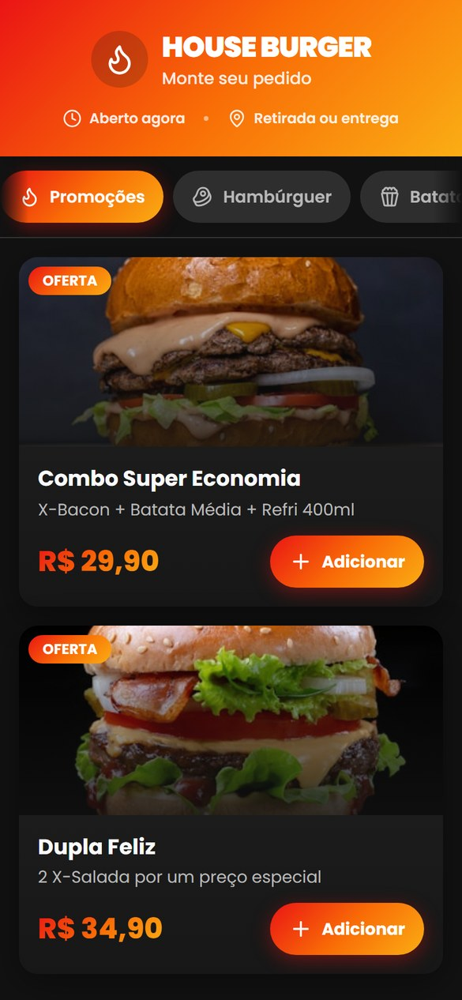
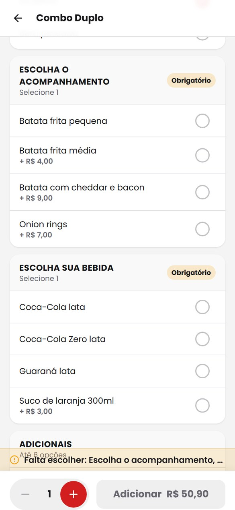
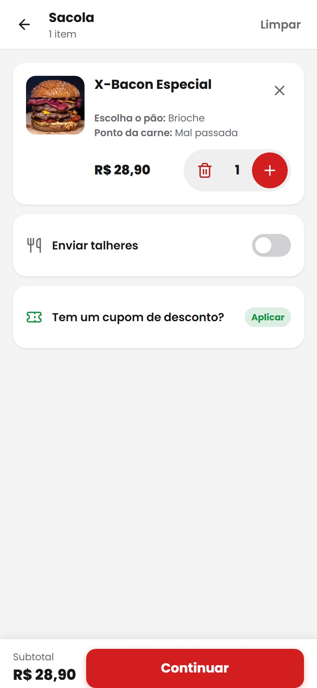
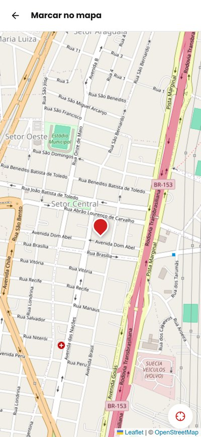
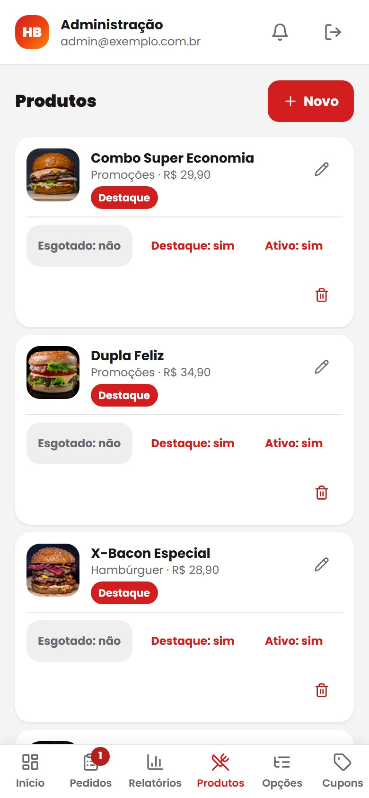
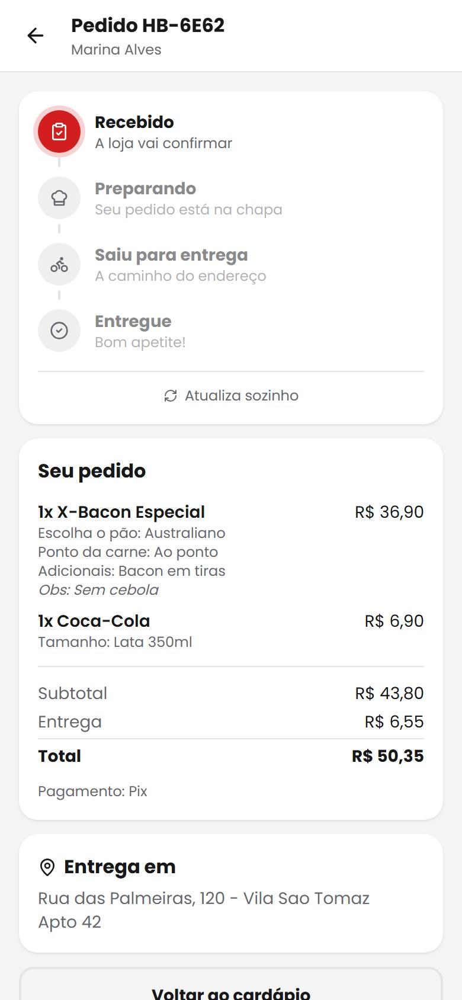
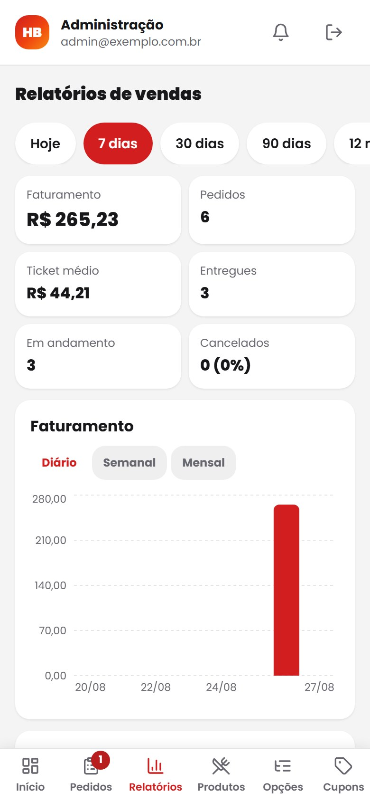
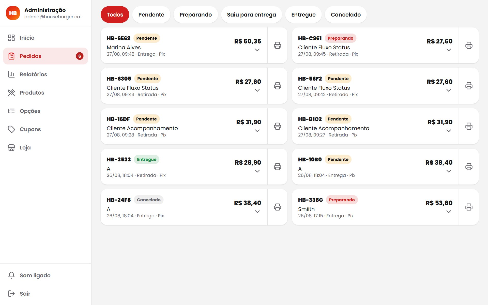

# House Burger

Cardápio digital para pedidos. O cliente monta o pedido no celular e envia a
comanda para o WhatsApp da loja; o dono administra cardápio, preços, taxas e
pedidos por um painel próprio, sem tocar em código.

Mobile-first: praticamente todo o acesso vem de celular, e as decisões de
interface partem daí.

## Telas

Capturas do aplicativo em execução, em viewport de celular (390 × 844).

<table>
  <tr>
    <td align="center"><br><sub><b>Cardápio</b></sub></td>
    <td align="center"><br><sub><b>Personalização</b></sub></td>
    <td align="center"><br><sub><b>Sacola</b></sub></td>
  </tr>
  <tr>
    <td align="center"><br><sub><b>Checkout</b></sub></td>
    <td align="center"><br><sub><b>Endereço no mapa</b></sub></td>
    <td align="center"><br><sub><b>Administração</b></sub></td>
  </tr>
  <tr>
    <td align="center"><br><sub><b>Acompanhamento</b></sub></td>
    <td align="center"><br><sub><b>Relatórios</b></sub></td>
    <td align="center"><br><sub><b>Admin no desktop</b></sub></td>
  </tr>
</table>

A última é em 1280 × 800: a partir de `md` o painel troca a navegação inferior
por barra lateral.

## Como funciona

1. **Loja** — vitrine de mais pedidos, busca e navegação por categoria.
2. **Produto** — grupos de personalização com mínimo e máximo. Enquanto houver
   grupo obrigatório pendente o botão fica travado, com o motivo visível e
   clicável, levando direto ao grupo que falta.
3. **Sacola** — cada linha mostra o que foi escolhido, porque o mesmo produto
   com opções diferentes são pedidos diferentes. Cupom e talheres aqui.
4. **Checkout** — retirada ou entrega, dados e o resumo com as contas abertas:
   subtotal, desconto, taxa de entrega, taxa de serviço e total.
5. **Registro e comanda** — o pedido é gravado no banco, que recalcula os
   valores, e a comanda sai formatada para o WhatsApp da cozinha.
6. **Acompanhamento** — logo após enviar, o cliente cai numa tela que mostra em
   que pé está o pedido, de Recebido a Entregue, com som ao mudar de etapa. Um
   botão reenvia a comanda pelo WhatsApp, para o caso de a janela do envio ter
   sido bloqueada.
7. **Meus pedidos** — os pedidos anteriores ficam listados em `/meus-pedidos`,
   guardados no próprio aparelho.

O dono acompanha os pedidos e edita o cardápio em `/admin`.

## Stack

| Camada | Escolha |
|---|---|
| Build | Vite 7 |
| UI | React 18 + TypeScript |
| Estilo | Tailwind CSS 3 + shadcn/ui |
| Rotas | React Router 7 |
| Dados e autenticação | Supabase (Postgres + Auth + Storage) |
| Mapa | Leaflet + OpenStreetMap |
| Ícones | lucide-react |

## Rodando localmente

Requer **Node.js 20.19+ ou 22.12+** — o Vite 7 declara
`^20.19.0 || >=22.12.0`, então a linha 21.x fica de fora.

O banco precisa estar configurado antes: veja [docs/SUPABASE.md](docs/SUPABASE.md).
Depois copie `.env.example` para `.env` e preencha as duas variáveis.

```sh
npm install
npm run dev
```

O servidor sobe em `http://localhost:8080` e também escuta na rede local — o
endereço `Network:` que aparece no terminal permite abrir o app no celular,
que é onde ele deve ser testado de verdade.

> **O GPS não funciona pelo endereço da rede.** A API de geolocalização só
> opera em contexto seguro: HTTPS ou `localhost`. Abrindo por
> `http://192.168.x.x`, o botão de localização avisa que é preciso HTTPS —
> mas o mapa continua utilizável arrastando o marcador, que é o caminho
> principal de qualquer forma.

| Script | O que faz |
|---|---|
| `npm run dev` | Servidor de desenvolvimento com HMR |
| `npm run build` | Build de produção em `dist/` |
| `npm run build:dev` | Build sem minificação, para depurar |
| `npm run preview` | Serve o `dist/` já construído |
| `npm run lint` | ESLint |

### Testes end-to-end

Os testes de interface, de intrusão e de auditoria da comanda são escritos em
Python com Playwright — por isso o `requirements.txt` na raiz:

```sh
python -m venv .venv
.venv\Scripts\activate           # Linux/macOS: source .venv/bin/activate
pip install -r requirements.txt
playwright install chromium
```

Um deles roda sem navegador e vale a cada mudança no SQL:

```sh
python tests/conferir_schema.py
```

Ele compara as colunas declaradas em `instalar.sql` com as que o banco devolve.
Existe porque o instalador já esteve sintaticamente perfeito e ainda assim
inutilizável: declarava `products.imagem_url` onde o banco tem `image_url`, e
`coupons.minimo` onde `create_order` procura `min_subtotal`. Validar sintaxe
não pega esse tipo de erro; comparar nomes pega.

## Estrutura

```
supabase/                       scripts SQL do banco
├── instalar.sql                banco inteiro: tabelas, funções, RLS, tempo real
├── atualizar.sql               diferenças para uma instalação já em operação
├── exemplo.sql                 cardápio de demonstração, para uma loja nova
├── limpar-pedidos.sql          apaga todos os pedidos, sem volta
└── seed.sql                    cardápio do House Burger

src/
├── pages/                      uma rota por arquivo
│   ├── Store.tsx               /              cardápio
│   ├── Product.tsx             /produto/:id   personalização
│   ├── Cart.tsx                /sacola
│   ├── Checkout.tsx            /checkout
│   ├── Payment.tsx             /pagamento
│   ├── Address.tsx             /endereco      mapa (sob demanda)
│   ├── TrackOrder.tsx          /pedido/:token acompanhamento (sob demanda)
│   ├── MyOrders.tsx            /meus-pedidos  histórico local (sob demanda)
│   └── admin/                  /admin/*       painel da loja (8 telas)
├── components/
│   ├── base/                   BottomBar, AppBar, Switch, CampoNumero, primitives
│   ├── store/                  StoreHero, CategoryChips, ProductRow, carrossel
│   ├── product/                OptionGroupField
│   ├── admin/                  AdminShell, CampoImagem, SeletorLocal
│   ├── PedidoEmAndamento.tsx   faixa de volta ao pedido em curso
│   └── CatalogGate.tsx         bloqueia o cliente sem cardápio carregado
├── store/
│   ├── cart.tsx                sacola, única no app e persistida
│   └── checkout.tsx            dados do pedido, só em memória
├── lib/
│   ├── api.ts                  leitura do catálogo e envio do pedido
│   ├── supabase.ts             cliente completo, só para o admin
│   ├── admin-api.ts            escritas do painel
│   ├── pricing.ts              cálculo do pedido e da taxa por distância
│   ├── orders.ts               chamada de create_order
│   ├── historico.ts            pedidos do cliente, só no aparelho
│   ├── imprimir.ts             comanda térmica de 80 mm
│   ├── som.ts                  alertas sintetizados, sem arquivo de áudio
│   └── whatsapp.ts             montagem e limpeza da comanda
├── hooks/use-alerta-pedidos.ts contagem de pendentes e alerta de pedido novo
├── data/catalog.ts             busca o cardápio do banco
└── types/order.ts              tipos do domínio

tests/
└── conferir_schema.py          compara o instalar.sql com o banco no ar
```

As rotas usam `React.lazy`. É o que mantém o Leaflet (~46 KB comprimidos) e o
`supabase-js` completo (~53 KB) fora do carregamento inicial: quem só quer pedir
um lanche baixa 112 KB.

As dependências são 16. Eram 52 até a limpeza: o projeto nasceu de um template
com 46 componentes do shadcn, e ao removê-los as bibliotecas ficaram
declaradas sem ninguém importá-las.

## Configuração

Tudo se ajusta pelo `/admin`, sem publicar código:

| Tela | O que controla |
|---|---|
| **Loja** | Nome, sigla do pedido, logo, banner, endereço e ponto no mapa, WhatsApp, chave Pix, taxas, pedido mínimo |
| **Produtos** | Cardápio, preços, fotos, categoria, destaque, esgotado e quais grupos de opções cada item usa |
| **Categorias** | Seções do cardápio: nome, ícone, ordem e ativa. É por aqui que o sistema deixa de ser de hamburgueria |
| **Opções** | Grupos de personalização, mínimo, máximo e o acréscimo de cada escolha |
| **Cupons** | Percentual, valor fixo ou entrega grátis, com subtotal mínimo e data de validade |
| **Pedidos** | Fila da cozinha, busca em todo o histórico, mudança de status e impressão da comanda |
| **Relatórios** | Faturamento, ticket médio, cancelamentos e itens mais vendidos por período |

No código só ficam as duas variáveis de ambiente em `.env`.

Para montar este mesmo sistema para **outra empresa**, com banco e dados
próprios, siga [docs/REPLICAR.md](docs/REPLICAR.md).

### Endereço da loja e retirada

O endereço cadastrado aparece no cabeçalho do cardápio e na tela de checkout
quando o cliente escolhe retirar, com link para abrir no mapa. O mesmo endereço
vai na comanda do WhatsApp, para servir de comprovante a quem não olhou o
cardápio.

### Taxa de entrega por distância

Em **Loja → Entrega e taxas** há dois modos:

- **Taxa única** — o mesmo valor para toda entrega.
- **Por distância** — `valor base + valor por km × distância`, medida em linha
  reta entre o ponto da loja e o ponto marcado pelo cliente. Um raio máximo
  opcional recusa pedidos além dele.

A tela mostra uma simulação para 1, 3, 5 e 10 km antes de salvar.

Duas consequências que valem entender:

- **É distância de mapa, não de rua.** O trajeto real costuma ser 20 a 40%
  maior; considere isso ao escolher o valor por quilômetro. Medir rota exigiria
  uma API paga com chave.
- **No modo por distância o ponto no mapa vira obrigatório** para entrega. Sem
  ele não há o que medir, e cair na taxa fixa premiaria quem não marcasse. O
  checkout avisa e leva ao mapa; o banco recusa o pedido de qualquer forma.

### Categorias, e o mesmo sistema em outro nicho

As seções do cardápio são dados, não código: nome, ícone, ordem e ativa saem de
`/admin` → **Categorias**. É o que permite instalar a mesma aplicação para uma
pizzaria sem tocar em nada — junto com a sigla do pedido, que também vem da
configuração da loja em vez de estar fixa como `HB-`.

Excluir uma categoria com produtos é recusado. A chave estrangeira é
`on delete set null`, então o banco deixaria passar e os produtos ficariam
órfãos, sumindo da navegação sem aviso. Para tirar do ar sem apagar, existe o
interruptor de ativa.

### Fila da cozinha e alertas

Sobre **Pedidos** fica um número em vermelho com quantos pedidos estão
**pendentes** — a fila do que ainda não foi aceito. Assim que a cozinha marca
"preparando", o pedido sai dessa conta.

Quando entra um pedido novo o painel dispara um **alarme** — sirene de duas
notas em onda quadrada, que atravessa o barulho da chapa — e repete a cada 15
segundos enquanto houver pedido pendente. Marcar "preparando" é o que silencia,
não o tempo: um alarme que para sozinho vira ruído de fundo que se aprende a
ignorar. O interruptor de som fica na barra lateral, é lembrado no aparelho e
desliga inclusive a repetição.

Se o dono autorizar pelo botão da faixa azul, sai também uma notificação do
sistema operacional.

O aviso vem de duas fontes: a assinatura em tempo real do Supabase, que chega no
instante do pedido, e uma varredura periódica como rede de segurança —
WebSocket cai em rede instável, e uma cozinha não pode perder pedido por isso.
A varredura é de 10 segundos até o tempo real **entregar um evento de verdade**,
e passa a 30 depois disso.

> **O tempo real precisa ser habilitado no banco.** O Supabase só transmite
> tabelas que estejam na publicação `supabase_realtime`, e isso não é
> automático. Sem isso o painel assina o canal, recebe `SUBSCRIBED` e nunca
> recebe evento nenhum — o pedido só aparece na varredura seguinte. O
> `instalar.sql` já cuida disso; numa instalação antiga, rode o
> `atualizar.sql`.
>
> Note que o estado do canal **não** serve de sinal: o servidor responde
> `phx_reply: ok` à assinatura e só depois manda um `system` com "Unable to
> subscribe to changes". Por isso o código só considera o tempo real ativo
> depois de receber um evento.

> A notificação do sistema exige HTTPS e permissão do navegador. Em `localhost`
> funciona; pelo IP da rede, não. O som e o número em vermelho cobrem esse caso.

### Impressão da comanda

O ícone de impressora em cada pedido abre a comanda pronta, em **80 mm** de
bobina: fonte monoespaçada, 32 colunas, sem cor, sem imagem e sem acento —
impressora térmica costuma trocar acento por lixo.

A comanda abre numa janela própria, com folha de estilo isolada, em vez de um
`@media print` na página do painel. Assim nenhuma classe nova em qualquer tela
vaza para o papel. Sai também em impressora comum, ocupando uma faixa da folha.

### Acompanhamento do pedido

Cada pedido recebe um `token` (UUID). O cliente vai para `/pedido/<token>` logo
após enviar, e o token fica guardado no aparelho — uma faixa no topo do cardápio
leva de volta ao pedido em andamento.

O código curto (`HB-4F2A`, com a sigla vinda da configuração da loja) **não**
serve como chave de acesso: são 4 dígitos hexadecimais, 65 mil combinações,
varríveis em minutos. A consulta é feita por uma função `security definer` que
recebe o token; o visitante continua sem permissão de leitura na tabela
`orders`.

A tela consulta a cada 12 segundos enquanto estiver visível e para sozinha
quando o pedido é entregue ou cancelado. Optei por isso em vez de WebSocket para
não trazer o `supabase-js` completo (~53 KB comprimidos) ao pacote do cliente —
numa hamburgueria, 12 segundos não mudam nada.

Um botão **reenvia a comanda pelo WhatsApp**. Abrir a conversa depende de uma
aba nova, e nenhum navegador garante isso: bloqueador de pop-up, aba fechada sem
querer, WhatsApp não instalado. Sem uma segunda porta, o pedido ficaria
registrado no banco sem a cozinha saber. A mensagem é remontada a partir do que
o servidor devolve, não de algo guardado no aparelho.

### Meus pedidos, e o que fica no aparelho

`/meus-pedidos` lista os pedidos anteriores. Sem login não há como o servidor
saber quem é quem, então a lista mora no `localStorage` — o registro do que foi
vendido continua inteiro no banco, que é de onde o painel sabe quem pediu o quê.

Guarda o mínimo para montar a lista e reabrir o acompanhamento: token, código,
data, total, tipo de entrega e quantidade de itens. **Nome, endereço e
coordenadas não entram.** Quem precisa deles busca no servidor apresentando o
token.

Trocar de aparelho ou limpar os dados do site apaga o histórico local; nenhum
pedido é cancelado por isso.

### Editando a comanda do WhatsApp

A mensagem montada em `src/lib/whatsapp.ts` é **texto simples**, lido na correria
da cozinha em aparelhos variados e com fontes incompletas. Ela já chegou
corrompida uma vez, com fileiras de `?` no lugar dos separadores e um `?` dentro
de cada preço. Ao mexer nela:

- **Use apenas ASCII e acentos.** Os separadores são hifens por isso. Traços de
  desenho de caixa como `━` (U+2501) faltam em muitas fontes de sistema.
- **Evite emoji.** Dependem de fonte colorida instalada, e alguns arrastam junto
  o seletor de variação U+FE0F, que vira um quadrado sozinho. O negrito do
  próprio WhatsApp, com `*asteriscos*`, já dá hierarquia suficiente.
- **Não confie no `Intl` para preços.** Ele separa `R$` do valor com espaço
  inseparável; `formatPrice` já normaliza isso.

`limparParaWhatsApp` é a última barreira antes do envio e remove espaços
inseparáveis, seletores de variação e marcas invisíveis de direção que podem
entrar por colagem no nome ou no endereço.

## Decisões de interface

O app é usado com uma mão, em movimento, muitas vezes com a tela suja de
gordura. Isso define as regras:

- **Rotas de verdade, não estado.** Sacola e checkout são endereços próprios, e
  o botão voltar do sistema fecha a tela certa em vez de sair do aplicativo.
- **Áreas seguras.** `viewport-fit=cover` no HTML e tokens `--safe-*` derivados
  de `env(safe-area-inset-*)`. Sem isso a barra fixa cai embaixo do indicador de
  gestos do iPhone e da barra de navegação do Android.
- **A barra inferior se mede.** Sua altura muda conforme aparece o aviso de
  pedido mínimo, de grupo pendente ou de área de entrega, então ela publica a
  altura real em `--bar-h` e o conteúdo reserva esse espaço.
- **Alvos de toque de 44px no mínimo** em todo controle (WCAG 2.5.5).
- **Sem depender de `hover`.** Estados de pressão usam `.press` / `.press-sm`,
  que recuam o elemento sem deslocar o layout ao redor.
- **Botão travado explica o motivo** — grupo obrigatório pendente, loja fechada,
  fora da área de entrega — e, quando dá, leva ao que resolve.
- **`prefers-reduced-motion`** desliga animações em laço e transformações.
- **`h-dvh` em vez de `100vh`**, que no mobile conta a barra do navegador.
- **Sem cardápio, sem pedido.** Se o banco não responde, o app mostra
  indisponibilidade em vez de preços que podem estar velhos.

## Modelo de confiança

O cliente envia ao servidor **apenas identificadores e quantidades**. Nenhum
preço, subtotal, taxa ou desconto sai do navegador.

Todo pedido entra pela função `create_order`, que recalcula do zero a partir das
tabelas: preço base, acréscimo de cada opção, cupom, taxa de entrega (inclusive
por distância), taxa de serviço e pedido mínimo. A comanda do WhatsApp é montada
do que essa função devolve. Editar o armazenamento local não muda o que a
cozinha recebe.

As permissões vivem na seção 6 do `supabase/instalar.sql`:

| Quem | Catálogo, taxas, cupons | Pedidos | Relatórios |
|---|---|---|---|
| Visitante | apenas leitura do que está ativo | não lê e não escreve | não |
| Dono autenticado | tudo | tudo | sim |

O visitante alcança um pedido por dois caminhos, os dois `security definer`:
`create_order`, para criar, e `consultar_pedido`, que devolve **um** pedido a
quem apresentar o token dele. A tabela `orders` continua fechada, então não há
como listar nem varrer. As funções `relatorio_*` recusam qualquer chamada sem
sessão autenticada, antes de tocar em dado nenhum.

A chave publicável vai embutida no JavaScript — isso é esperado. Ela só é segura
porque as regras acima limitam o que o visitante pode fazer. Chaves de servidor
(`service_role`, `sb_secret_`) nunca entram no código nem em variável com
prefixo `VITE_`.

A sacola persistida guarda só identificadores; nome, preço e acréscimos são
relidos do catálogo a cada carga. A leitura valida produto, grupo, opção,
limites de quantidade e o cupom, e descarta sacolas com mais de 12 horas.

**Endereço e geolocalização do cliente não são persistidos** no navegador: os
dados do checkout vivem só em memória. O histórico de `/meus-pedidos` é a única
coisa que fica gravada, e guarda apenas token, código, data, total, tipo de
entrega e quantidade de itens — nada que identifique a pessoa ou o lugar. Quem
quiser o endereço de volta busca no servidor com o token.

**Cupons validados no cliente são conveniência, não defesa** — o desconto real é
o que o servidor calcula ao registrar o pedido.

## Licença

Projeto privado.
