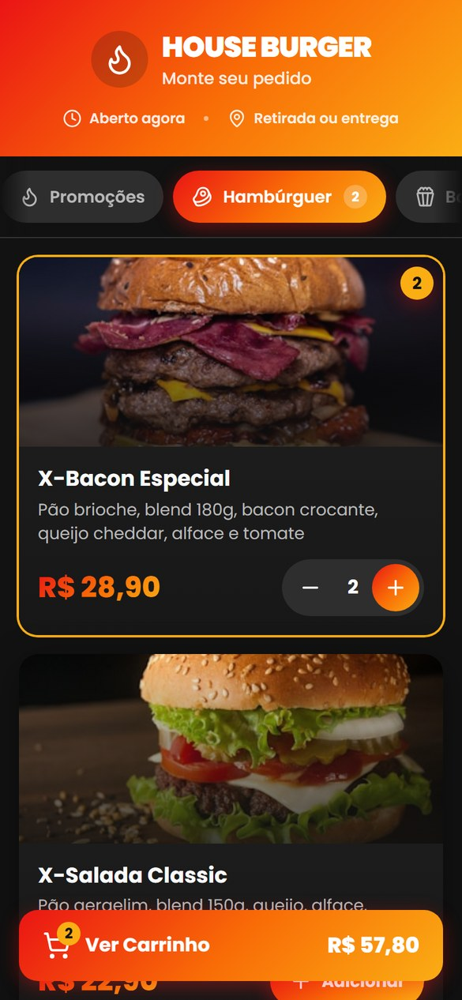
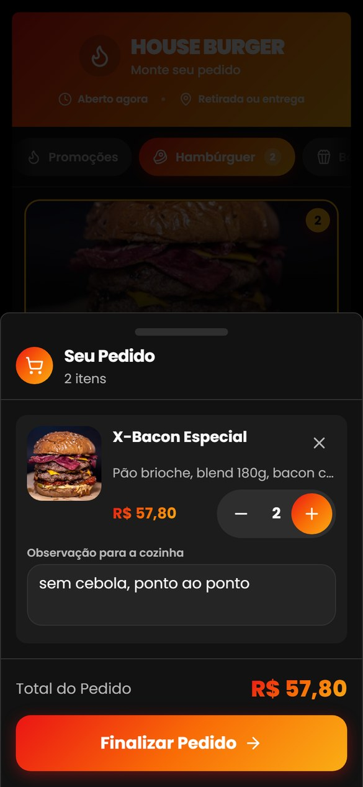

# House Burger

Cardápio digital para pedidos. O cliente monta o pedido no celular e envia direto
para o WhatsApp da hamburgueria — não há backend, cadastro nem pagamento online.

Mobile-first: praticamente todo o acesso vem de celular, e as decisões de
interface partem daí.

## Telas

Capturas do aplicativo em execução, em viewport de celular (390 × 844).

| Cardápio | Item no carrinho | Carrinho | Checkout |
|---|---|---|---|
|  |  |  |  |

Da esquerda para a direita: a navegação por categorias com ancoragem de
rolagem; o card depois do primeiro toque, com o botão de adicionar dando lugar
ao controle de quantidade e o contador aparecendo na aba e no card; o carrinho
como painel inferior arrastável, com o campo de observação aberto; e a segunda
etapa do checkout, com validação por campo e a forma de pagamento marcada por
ícone além da cor.

## Stack

| Camada | Escolha |
|---|---|
| Build | Vite 7 |
| UI | React 18 + TypeScript |
| Estilo | Tailwind CSS 3 + shadcn/ui |
| Bottom sheet | vaul |
| Ícones | lucide-react |
| Notificações | sonner |

## Rodando localmente

Requer **Node.js 20.19+ ou 22.12+** — o Vite 7 declara
`^20.19.0 || >=22.12.0`, então a linha 21.x fica de fora.

```sh
npm install
npm run dev
```

O servidor sobe em `http://localhost:8080` e também escuta na rede local — o
endereço `Network:` que aparece no terminal permite abrir o app no celular,
que é onde ele deve ser testado de verdade.

> **A captura de localização não funciona pelo endereço da rede.** A API de
> geolocalização do navegador só opera em contexto seguro: HTTPS ou
> `localhost`. Abrindo por `http://192.168.x.x`, o botão "Usar minha
> localização atual" avisa que é preciso HTTPS e o resto do pedido segue
> normalmente. Para exercitar o mapa no celular, exponha o servidor por um
> túnel HTTPS. Todo o restante da interface pode ser testado pela rede sem
> ressalva.

| Script | O que faz |
|---|---|
| `npm run dev` | Servidor de desenvolvimento com HMR |
| `npm run build` | Build de produção em `dist/` |
| `npm run build:dev` | Build sem minificação, para depurar |
| `npm run preview` | Serve o `dist/` já construído |
| `npm run lint` | ESLint |

### Testes end-to-end

Os testes de interface e de intrusão são escritos em Python com Playwright —
por isso o `requirements.txt` na raiz. Eles são independentes do build:

```sh
python -m venv .venv
.venv\Scripts\activate           # Linux/macOS: source .venv/bin/activate
pip install -r requirements.txt
playwright install chromium
```

Com o `npm run dev` no ar, os testes dirigem o app num viewport de celular e
verificam alvos de toque, áreas seguras, o fluxo de pedido e a resistência do
carrinho persistido a adulteração.

## Estrutura

```
src/
├── components/
│   ├── Header.tsx              cabeçalho + status da loja
│   ├── CategoryTabs.tsx        navegação por categoria (scroll-snap)
│   ├── ProductCard.tsx         card com stepper de quantidade embutido
│   ├── Cart.tsx                carrinho como bottom sheet (vaul)
│   ├── CartItem.tsx            item do carrinho + observação
│   ├── FloatingCartButton.tsx  CTA fixo com total
│   ├── CheckoutFlow.tsx        2 etapas → monta a mensagem do WhatsApp
│   └── ui/                     componentes shadcn/ui (gerados)
├── hooks/
│   └── use-persistent-cart.ts  carrinho que sobrevive ao reload
├── lib/
│   ├── format.ts               formatação de preço em BRL
│   └── haptics.ts              feedback tátil
├── data/products.ts            catálogo
├── types/order.ts              tipos, rótulos e ícones de categoria
└── pages/Index.tsx             tela principal
```

## Configuração

Não há variáveis de ambiente. Os dois pontos que se ajustam no código:

- **Número do WhatsApp** — constante `WHATSAPP_NUMBER` em
  `src/components/CheckoutFlow.tsx`, no formato internacional sem símbolos
  (ex.: `5562999718912`).
- **Cardápio** — `src/data/products.ts`. Cada produto precisa de `id` único,
  `category` correspondente a uma das chaves de `Category` (`src/types/order.ts`)
  e uma `image` acessível por URL.

Ao remover um produto do cardápio, carrinhos salvos que o referenciem
simplesmente descartam aquele item — não é preciso migrar nada.

### Editando a comanda do WhatsApp

A mensagem montada em `generateWhatsAppMessage` é **texto simples**, lido na
correria da cozinha em aparelhos variados e com fontes incompletas. Ela já
chegou corrompida uma vez, com fileiras de `?` no lugar das linhas
separadoras e um `?` dentro de cada preço. Ao mexer nela:

- **Use apenas ASCII e acentos.** Os separadores são hifens por isso. A versão
  anterior usava `━` (U+2501), o traço pesado de desenho de caixa, ausente em
  muitas fontes de sistema — eram 72 por comanda.
- **Evite emoji.** Dependem de fonte colorida instalada, e alguns arrastam
  junto o seletor de variação U+FE0F, que vira um quadrado sozinho. O negrito
  do próprio WhatsApp, com `*asteriscos*`, já dá hierarquia suficiente.
- **Não confie no `Intl` para preços.** Ele separa `R$` do valor com espaço
  inseparável; `formatPrice` já normaliza isso.

A função `limparParaWhatsApp` é a última barreira antes do envio e remove
espaços inseparáveis, seletores de variação e marcas invisíveis de direção que
podem entrar por colagem no nome ou no endereço. Ela é rede de proteção, não
licença para reintroduzir caracteres arriscados no texto.

## Decisões de interface

O app é usado com uma mão, em movimento, muitas vezes com a tela suja de
gordura. Isso define as regras:

- **Áreas seguras.** `viewport-fit=cover` no HTML e tokens `--safe-*` derivados
  de `env(safe-area-inset-*)`. Sem isso, o CTA fixo cai embaixo do indicador de
  gestos do iPhone e da barra de navegação do Android.
- **Alvos de toque de 44px no mínimo** em todo controle interativo (WCAG 2.5.5).
- **Sem depender de `hover`.** Estados de pressão usam as classes `.press` /
  `.press-sm`, que recuam o elemento sem deslocar o layout ao redor.
- **Feedback tátil** (`src/lib/haptics.ts`) apenas em confirmações reais.
  Silencioso onde a API não existe — iOS Safari incluso.
- **`prefers-reduced-motion`** desliga animações em laço e transformações.
- **Erros de formulário ao lado do campo**, com `role="alert"` e foco levado ao
  primeiro campo inválido.
- **`h-dvh` em vez de `100vh`**, que no mobile conta a barra do navegador e
  empurra rodapés fixos para fora da tela.

## Modelo de confiança

Todo o pedido é calculado no navegador e a URL do WhatsApp é montada no próprio
cliente. Sem servidor, **nada do que o cliente guarda pode ser tratado como
confiável**.

Por isso o carrinho persistido em `localStorage` grava apenas
`{ id, quantity, notes }`. Preço, nome e descrição são sempre relidos de
`src/data/products.ts` na carga. Guardar o preço permitiria editar o
armazenamento local e enviar um pedido com valor forjado para a cozinha.

A leitura ainda valida cada item: o `id` precisa existir no cardápio atual, a
quantidade precisa ser inteira entre 1 e 99, a observação é truncada, e
carrinhos com mais de 12 horas são descartados porque os preços podem ter
mudado. Endereço e geolocalização nunca são persistidos.

Se um dia entrar um backend, **o total precisa ser recalculado no servidor** a
partir dos ids recebidos. A validação do cliente é conveniência, não defesa.

## Licença

Projeto privado.
